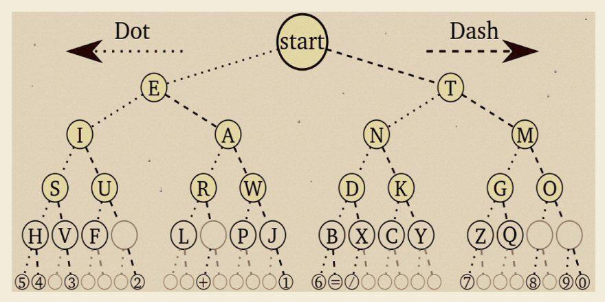

# 🌲 Árvore Binária com Código Morse
<div align="center">
  
</div>

## 📚 Descrição

Este projeto implementa uma **árvore binária** que representa os caracteres alfanuméricos (A–Z e 0–9) por meio do **código Morse**, onde:
- Cada ponto (`.`) representa um movimento para a esquerda.
- Cada traço (`-`) representa um movimento para a direita.

A árvore permite:
- Inserção automática dos caracteres via código Morse.
- Codificação de mensagens (texto ➡️ morse).
- Decodificação de mensagens (morse ➡️ texto).
- Busca de um caractere pelo código morse.
- Visualização completa da árvore.
---

## ⚙️ Como funciona

### 📌 Representação
Cada caminho da raiz até um nó forma um código Morse.  
Exemplo:
```
.-  A
-...  B
... --- ...  ➡️ SOS
```
---

### 📦 Classes principais

#### `ArvoreBinariaMorse`
Contém:
- Classe interna `No` (nó da árvore).
- Métodos para:
    - Inserir caracteres com base no código Morse.
    - Buscar caracteres.
    - Codificar e decodificar mensagens.
    - Exibir a árvore completa.

#### `Main`
Interface via terminal:
- Menu interativo com 5 opções:
    1. Codificar mensagem (texto ➡️ morse)
    2. Decodificar mensagem (morse ➡️ texto)
    3. Buscar caractere por código morse
    4. Exibir árvore morse
    0. Sair

#### `TesteArvore`
Classe de testes simples para inserção manual de caracteres e exibição da árvore.

---

## 📎 Regras de uso

- ✅ Todos os caracteres devem ser **maiúsculos e sem acento**.
- ✅ Na decodificação, **cada caractere morse deve ser separado por espaço**.
- ✅ **Duas letras separadas por dois espaços** representam palavras distintas.

---

## 💻 Exemplo de uso

**Entrada:**
```
ESTRUTURA DE DADOS
```

**Código Morse:**
```
. ... - .-. ..- - ..- .-. .-  -.. .  -.. .- -.. --- ...
```

**Saída decodificada:**
```
ESTRUTURA DE DADOS
```

---

## 🚫 Restrições do projeto

- ❌ **Não usar**: `StringBuilder`, `Vector`, `ArrayList`, `Exception`, `split()`, entre outros.
- ✅ **Apenas permitido**: `String`, `int`, `length()`, `charAt()`.

---

## 👨‍💻 Integrantes

- Paulo Vitor
- Diego Marquetti
- Lucas Cunha da Silva

---

## 🎥 Vídeo explicativo

✅ O vídeo de apresentação do projeto está disponível no YouTube em:  
[**LINK_DO_VÍDEO**]  
(*link do vídeo*)

---


